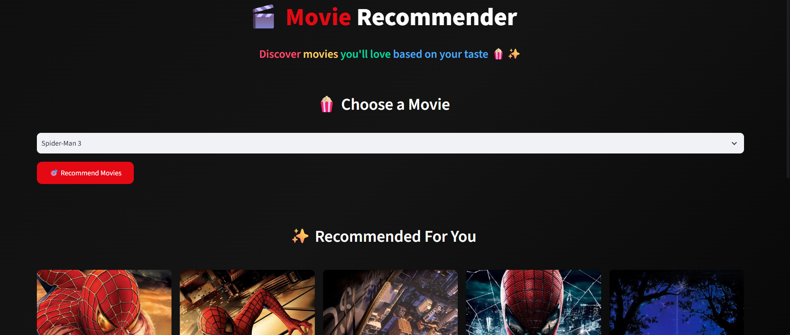
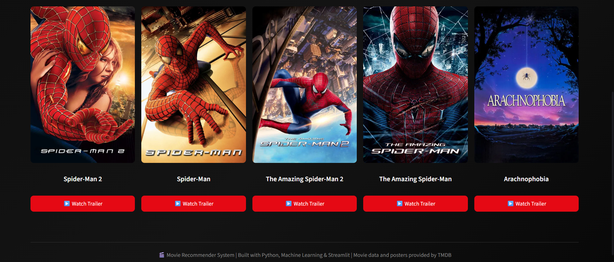

# 🎬 Movie Recommender System


A **content-based movie recommendation system** built using **Python, Machine Learning, NLP, Pandas, Scikit-learn, Streamlit, and the TMDB API**.


The application recommends movies similar to a movie selected by the user. It combines movie metadata such as **overview, genres, keywords, cast, and director** into a single feature representation and uses **CountVectorizer** and **cosine similarity** to generate recommendations.


The project demonstrates practical implementation of:


- Data preprocessing

- Feature engineering

- Natural Language Processing

- Text vectorization

- Similarity-based recommendation

- REST API integration

- Streamlit application development

- Model serialization

- Git/GitHub

- API secret management

- Deployment configuration


---


## 🌐 Live Demo


🚀 **Streamlit App:**  

Add your deployed Streamlit URL here after deployment.


```text

https://your-app-name.streamlit.app

```


---


## 📸 Application Screenshots


### 🏠 Home Page





### 🎬 Movie Recommendations





---


# 📌 Project Overview


The Movie Recommender System is a **content-based recommendation system**.


Instead of relying on user ratings or collaborative filtering, the system recommends movies based on the **content and metadata of the movies**.


The project uses the **TMDB 5000 Movies and Credits datasets**.


For each movie, the following information is extracted:


- Movie overview

- Genres

- Keywords

- Top 3 cast members

- Director


These features are combined into a single `tags` column.


The text is then:


1. Converted to lowercase

2. Cleaned

3. Stemmed using the **Porter Stemmer**

4. Converted into numerical vectors using **CountVectorizer**

5. Compared using **cosine similarity**


When a user selects a movie, the system finds the movies with the highest similarity scores and returns the **top 5 recommendations**.


The Streamlit application additionally uses the **TMDB API** to retrieve:


- Movie posters

- Movie information

- YouTube trailer information


---


# ✨ Features


- 🎬 Searchable movie selection

- 🤖 Content-based movie recommendation

- 🧠 NLP-based text preprocessing

- 📊 CountVectorizer feature extraction

- 📐 Cosine similarity

- 🎭 Genre-based similarity

- 🎯 Keyword-based similarity

- 👨‍🎤 Cast-based similarity

- 🎥 Director-based similarity

- 🖼️ TMDB movie poster retrieval

- ▶️ YouTube trailer retrieval through TMDB

- 🔎 TMDB fallback movie search

- 🎨 Custom Streamlit interface

- 🔐 Secure API key management using Streamlit Secrets

- 💾 Serialized ML artifacts using Pickle

- ☁️ Streamlit deployment support

- 📦 Git LFS support for large model files


---


# 🧠 How the Recommendation System Works


The recommendation pipeline is:


```text

                    TMDB Movies Dataset

                           +

                    TMDB Credits Dataset

                           │

                           â–¼

                       Merge Data

                           │

                           â–¼

                   Select Required Columns

                           │

                           â–¼

                    Handle Missing Values

                           │

                           â–¼

                    Parse JSON-like Data

                           │

                           â–¼

              ┌───────────────────────────┐

              │       Feature Extraction  │

              │                           │

              │ • Overview                │

              │ • Genres                  │

              │ • Keywords                │

              │ • Top 3 Cast Members      │

              │ • Director                │

              └───────────────────────────┘

                           │

                           â–¼

                     Create "tags"

                           │

                           â–¼

                    Text Cleaning

                           │

                           â–¼

                    Lowercase Text

                           │

                           â–¼

                    Porter Stemming

                           │

                           â–¼

                  CountVectorizer

                  max_features=5000

                           │

                           â–¼

                    Movie Vectors

                           │

                           â–¼

                  Cosine Similarity

                           │

                           â–¼

                Similarity Matrix

                           │

                           â–¼

                 Find Top 5 Movies

                           │

                           â–¼

                    Streamlit App

                           │

                           â–¼

                      TMDB API

                    /           \\

               Posters        Trailers

```


---


# 🛠️ Tech Stack


| Technology | Purpose |

|---|---|

| Python | Core programming language |

| Pandas | Data loading and preprocessing |

| NumPy | Numerical operations |

| Scikit-learn | CountVectorizer and cosine similarity |

| NLTK | Porter stemming |

| Streamlit | Web application and UI |

| Requests | HTTP/API requests |

| TMDB API | Movie information, posters and videos |

| Pickle | Model/data serialization |

| Jupyter Notebook | Data exploration and experimentation |

| Git | Version control |

| GitHub | Repository hosting |

| Git LFS | Large file storage |


---


# 📂 Project Structure


```text

Movie_Recommender_System/

│

├── app.py

├── train_model.py

├── Movie_Recommender_System.ipynb

│

├── tmdb_5000_movies.csv

├── tmdb_5000_credits.csv

│

├── movies.pkl

├── movie_dict.pkl

├── similarity.pkl

│

├── requirements.txt

├── Procfile

├── setup.sh

├── .gitignore

├── .gitattributes

│

├── .streamlit/

│   └── secrets.toml

│

├── screenshots/

│   ├── home.png

│   └── recommendations.png

│

└── README.md

```


---


# 📄 Important Files


## `app.py`


The main Streamlit application.


It:


- Loads the recommendation model

- Displays the movie selector

- Generates recommendations

- Connects to TMDB

- Retrieves posters

- Retrieves trailers

- Displays the recommendation results


---


## `train_model.py`


Contains the complete machine-learning pipeline.


It performs:


- Dataset loading

- Dataset merging

- Data cleaning

- Feature extraction

- Tag creation

- Text preprocessing

- Porter stemming

- CountVectorizer

- Cosine similarity

- Model serialization


Running:


```bash

python train_model.py

```


generates the required `.pkl` files.


---


## `Movie_Recommender_System.ipynb`


Jupyter Notebook containing the data analysis, preprocessing, feature engineering, NLP processing, and recommendation-system development workflow.


---


## `tmdb_5000_movies.csv`


Contains movie metadata from the TMDB 5000 dataset.


---


## `tmdb_5000_credits.csv`


Contains movie cast and crew information.


---


## `movies.pkl`


Stores the processed movie DataFrame.


---


## `movie_dict.pkl`


Stores processed movie information in dictionary form for efficient loading by the Streamlit application.


---


## `similarity.pkl`


Stores the movie-to-movie cosine similarity matrix.


This file can be large because it contains similarity scores between thousands of movies.


---


## `requirements.txt`


Contains the Python dependencies required to run the application.


---


## `Procfile`


Contains the command required for deployment on platforms supporting Procfile-based applications.


---


## `setup.sh`


Contains Streamlit server configuration used during deployment.


---


# 🔬 Machine Learning Approach


## 1. Data Loading


The project uses two datasets:


```text

tmdb_5000_movies.csv

tmdb_5000_credits.csv

```


They contain movie information and credits respectively.


---


# 2. Data Merging


The movie and credit datasets are merged using the movie title.


Conceptually:


```python

movies = movies.merge(

    credits,

    on="title"

)

```


---


# 3. Feature Selection


The following columns are retained:


```text

movie_id

title

overview

genres

keywords

cast

crew

```


---


# 4. Handling Missing Values


Missing values are handled before feature extraction.


For example:


```python

movies["overview"] = movies["overview"].fillna("")

movies["genres"] = movies["genres"].fillna("[]")

movies["keywords"] = movies["keywords"].fillna("[]")

movies["cast"] = movies["cast"].fillna("[]")

movies["crew"] = movies["crew"].fillna("[]")

```


---


# 5. Parsing JSON-like Data


The `genres`, `keywords`, `cast`, and `crew` columns contain JSON-like strings.


They are converted into Python objects using:


```python

ast.literal_eval()

```


For example:


```text

[

    {

        "id": 28,

        "name": "Action"

    },

    {

        "id": 12,

        "name": "Adventure"

    }

]

```


is converted into a Python list of dictionaries.


---


# 6. Feature Extraction


The system extracts the following features.


### Genres


All genres associated with a movie are extracted.


Example:


```text

Action

Adventure

ScienceFiction

```


---


### Keywords


Movie keywords are extracted from the dataset.


Example:


```text

space

alien

future

robot

```


---


### Cast


The first three cast members are used.


Example:


```text

TomHanks

MegRyan

BillPullman

```


---


### Director


The director is extracted from the crew information.


Example:


```text

ChristopherNolan

```


---


# 7. Creating the `tags` Feature


All relevant information is combined into one text feature:


```text

Overview

+

Genres

+

Keywords

+

Top 3 Cast

+

Director

```


Conceptually:


```python

tags = (

    overview

    + genres

    + keywords

    + cast

    + director

)

```


This allows the movie to be represented as a single text document.


---


# 8. Text Preprocessing


The generated tags are:


- Converted to strings

- Converted to lowercase

- Cleaned

- Tokenized

- Stemmed


Example:


```text

loving

loved

love

```


may be reduced toward a common stem such as:


```text

love

```


---


# 9. Porter Stemmer


The project uses the NLTK Porter Stemmer:


```python

from nltk.stem.porter import PorterStemmer


ps = PorterStemmer()

```


The stemmer is applied to the words in the `tags` feature.


---


# 10. CountVectorizer


The processed text is converted into numerical vectors using:


```python

CountVectorizer(

    max_features=5000,

    stop_words="english"

)

```


The vectorizer converts the movie text into a numerical representation.


Example:


```text

Movie A → [0, 1, 0, 3, 0, 1, ...]

Movie B → [1, 0, 0, 2, 1, 0, ...]

Movie C → [0, 1, 1, 0, 0, 2, ...]

```


---


# 11. Cosine Similarity


Cosine similarity is used to measure similarity between movie vectors.


```python

from sklearn.metrics.pairwise import cosine_similarity


similarity = cosine_similarity(vectors)

```


The result is a similarity matrix.


Conceptually:


```text

              Movie A    Movie B    Movie C

Movie A         1.00       0.82       0.21

Movie B         0.82       1.00       0.35

Movie C         0.21       0.35       1.00

```


A higher similarity score indicates that the movies have more similar content representations.


---


# 🎯 Recommendation Process


When a user selects a movie:


### Step 1


Find the selected movie's index.


```python

movie_index = movies.index[

    movies["title"] == selected_movie

][0]

```


### Step 2


Retrieve the movie's similarity scores.


```python

distances = similarity[movie_index]

```


### Step 3


Sort movies by similarity.


```python

sorted(

    list(enumerate(distances)),

    reverse=True,

    key=lambda x: x[1]

)

```


### Step 4


Remove the selected movie itself.


### Step 5


Return the top 5 similar movies.


---


# 🌐 Streamlit Application


The Streamlit application provides the user interface for the recommendation system.


The application:


1. Loads `movie_dict.pkl`

2. Loads `similarity.pkl`

3. Creates a searchable movie selector

4. Accepts the selected movie

5. Calculates recommendations

6. Retrieves movie information from TMDB

7. Retrieves movie posters

8. Retrieves trailers

9. Displays five recommendations


---


# 🎬 TMDB API Integration


The application uses the TMDB API to retrieve additional movie information.


The API is used for:


- Movie search

- Movie information

- Movie posters

- Movie videos

- Trailer information


The poster URL is generated using the TMDB image service.


The application also contains fallback logic.


If a direct TMDB movie ID lookup fails, the application searches TMDB using the movie title.


---


# 🔐 API Key Configuration


The TMDB API key should **never be hard-coded into the Python source code**.


For local development, create:


```text

.streamlit/secrets.toml

```


Add:


```toml

TMDB_API_KEY = "YOUR_TMDB_API_KEY"

```


The application reads the key using:


```python

st.secrets["TMDB_API_KEY"]

```


### ⚠️ Important


Never commit:


```text

.streamlit/secrets.toml

```


to GitHub.


Add it to `.gitignore`:


```gitignore

.streamlit/secrets.toml

```


---


# 💻 Installation


## 1. Clone the Repository


```bash

git clone https://github.com/ankansadhukhan2025-ui/Movie_Recommender_System.git

```


Navigate into the project:


```bash

cd Movie_Recommender_System

```


---


# 2. Create a Virtual Environment


### Windows


```bash

python -m venv .venv

```


Activate it:


```bash

.venv\\Scripts\\activate

```


### Linux/macOS


```bash

python3 -m venv .venv

```


Activate it:


```bash

source .venv/bin/activate

```


---


# 3. Install Dependencies


```bash

pip install -r requirements.txt

```


---


# 4. Configure TMDB API Key


Create:


```text

.streamlit/secrets.toml

```


Add:


```toml

TMDB_API_KEY = "YOUR_TMDB_API_KEY"

```


---


# 5. Generate the Model


If the serialized model files are already available, you can directly run the application.


Otherwise, generate them using:


```bash

python train_model.py

```


This creates:


```text

movies.pkl

movie_dict.pkl

similarity.pkl

```


---


# 6. Run the Streamlit Application


```bash

streamlit run app.py

```


The application will be available at:


```text

http://localhost:8501

```


---


# 📊 Dataset


This project uses the **TMDB 5000 Movie Dataset**.


The project uses:


```text

tmdb_5000_movies.csv

tmdb_5000_credits.csv

```


The dataset provides information including:


- Movie titles

- Movie overviews

- Genres

- Keywords

- Cast

- Crew

- Movie IDs


The TMDB API is used separately by the application for additional poster and video information.


---


# 📈 Recommendation Example


Suppose the user selects:


```text

The Dark Knight

```


The system analyzes its content representation and compares it against the representations of the other movies.


The application then returns the five movies with the highest cosine-similarity scores.


The exact recommendations depend on the dataset, preprocessing pipeline, and feature representation.


---


# 🧪 Example Workflow


```text

User

 │

 â–¼

Select Movie

 │

 â–¼

Streamlit Application

 │

 â–¼

Find Movie Index

 │

 â–¼

Retrieve Similarity Scores

 │

 â–¼

Sort Similarity Scores

 │

 â–¼

Select Top 5 Movies

 │

 ├───────────────┐

 â–¼               â–¼

TMDB API       Recommendation

 │

 ├── Poster

 │

 └── Trailer

 │

 â–¼

Display Results

```


---


# 📦 Model Artifacts


The project uses serialized files to avoid rebuilding the recommendation model every time the Streamlit application starts.


### `movies.pkl`


Processed movie DataFrame.


### `movie_dict.pkl`


Movie metadata stored as a list of dictionaries.


### `similarity.pkl`


Cosine similarity matrix.


This allows the Streamlit application to load the precomputed recommendation data directly.


---


# ⚠️ Large File Handling


The `similarity.pkl` file can be relatively large because it contains the complete movie-to-movie similarity matrix.


For approximately 5,000 movies, the similarity matrix contains millions of similarity values.


Therefore, Git LFS can be used to manage the file.


Install Git LFS:


```bash

git lfs install

```


Track pickle files:


```bash

git lfs track "*.pkl"

```


Then:


```bash

git add .gitattributes

git add .

git commit -m "Add movie recommender system"

git push origin main

```


---


# 🧹 Recommended `.gitignore`


```gitignore

# Python

__pycache__/

*.py[cod]


# Virtual environment

.venv/

venv/

env/


# Jupyter

.ipynb_checkpoints/


# Streamlit

.streamlit/secrets.toml


# IDE

.vscode/

.idea/


# OS

.DS_Store

Thumbs.db


# Temporary files

*.tmp

*.log

```


---


# 🚀 Deployment


The application can be deployed using a Streamlit-compatible deployment platform.


Typical deployment steps are:


```text

GitHub Repository

       │

       â–¼

Connect Repository

       │

       â–¼

Select app.py

       │

       â–¼

Configure Python Dependencies

       │

       â–¼

Add TMDB_API_KEY Secret

       │

       â–¼

Deploy

       │

       â–¼

Streamlit Application

```


For deployment, make sure the following files are present:


```text

app.py

requirements.txt

movie_dict.pkl

similarity.pkl

```


and any other required project files.


The TMDB API key should be added through the deployment platform's secret-management interface rather than committed to the repository.


---


# 🔮 Future Improvements


The current system is a content-based recommender. Several improvements could make the project more advanced.


## 1. Hybrid Recommendation


Combine content-based recommendations with collaborative filtering.


```text

Content-Based

      +

Collaborative Filtering

      ↓

Hybrid Recommendation

```


---


## 2. User Personalization


Add user accounts and recommendation history.


```text

User

 ↓

Watch History

 ↓

Favorite Movies

 ↓

Genre Preferences

 ↓

Personalized Recommendations

```


---


## 3. Movie Ratings


Display:


- TMDB rating

- Vote count

- Release date

- Runtime


---


## 4. Genre Filtering


Allow users to filter recommendations by:


- Action

- Comedy

- Drama

- Thriller

- Romance

- Sci-Fi

- Horror

- Adventure


---


## 5. Better Search


Improve movie searching using:


- Fuzzy matching

- Search suggestions

- Autocomplete

- Alternative titles


---


## 6. Recommendation Evaluation


Introduce recommendation-system evaluation metrics such as:


- Precision

- Recall

- Mean Average Precision

- Diversity

- Novelty


---


## 7. Improved NLP


The current system uses CountVectorizer and Porter stemming.


Future versions could explore:


- TF-IDF

- Word2Vec

- GloVe

- FastText

- Sentence Transformers

- BERT embeddings


---


## 8. Better Similarity Models


Future implementations could compare:


```text

CountVectorizer

       ↓

TF-IDF

       ↓

Word Embeddings

       ↓

Transformer Embeddings

```


---


## 9. Recommendation History


Allow users to see previously generated recommendations.


---


## 10. More Detailed Movie Pages


A future version could display:


- Poster

- Overview

- Genres

- Cast

- Director

- Rating

- Release date

- Runtime

- Budget

- Revenue

- Trailer

- Similar movies


---


# 📚 What I Learned


This project helped me develop practical experience in:


### Python


- Functions

- File handling

- Exception handling

- API requests

- Object/data serialization


### Data Science


- Pandas

- Data cleaning

- Data transformation

- Feature engineering


### Machine Learning


- Feature extraction

- Vectorization

- Cosine similarity

- Recommendation systems


### NLP


- Text preprocessing

- Tokenization

- Stop-word removal

- Stemming

- CountVectorizer


### APIs


- REST API integration

- HTTP requests

- JSON responses

- API authentication

- Error handling

- API fallback logic


### Streamlit


- Interactive UI

- Select boxes

- Buttons

- Columns

- Images

- Caching

- Secrets management


### Software Development


- Git

- GitHub

- Git LFS

- Environment management

- Deployment configuration


---


# 🧩 Challenges Faced


Some practical challenges addressed by this project include:


### Handling JSON-like Dataset Columns


The TMDB dataset contains nested information inside string representations of lists and dictionaries.


This required parsing with:


```python

ast.literal_eval()

```


---


### Missing Data


Movie metadata can contain missing values.


The preprocessing pipeline handles missing values before feature extraction.


---


### Movie Matching


The movie title in the local dataset does not always perfectly match TMDB's search results.


The application therefore includes fallback title-search logic.


---


### Large Similarity Matrix


Calculating similarity between thousands of movies produces a large matrix.


The precomputed matrix is serialized and stored so the Streamlit application does not need to recalculate it every time.


---


### API Failures


TMDB requests can fail because of:


- Invalid API keys

- Network problems

- Missing movie information

- API rate limits

- Missing posters

- Missing trailers


The application includes fallback and error-handling logic.


---


# 🔒 Security


Never commit API keys or other secrets to GitHub.


### ❌ Do not do this


```python

TMDB_API_KEY = "123456789abcdef"

```


### ✅ Use Streamlit Secrets


```toml

TMDB_API_KEY = "YOUR_TMDB_API_KEY"

```


and:


```python

st.secrets["TMDB_API_KEY"]

```


Also make sure the following file is ignored:


```text

.streamlit/secrets.toml

```


---


# 📜 License


This project is intended for **educational and portfolio purposes**.


The movie dataset and TMDB-related content are subject to their respective licenses and terms of use.


For information about TMDB, refer to the official TMDB documentation and terms.


---


# 👨‍💻 Author


## Ankan Sadhukhan


**M.Sc. Mathematics and Computing**  

**Indian Institute of Technology (Indian School of Mines), Dhanbad**


I am interested in:


- Machine Learning

- Data Science

- Natural Language Processing

- Recommendation Systems

- Python

- Mathematical Computing

- Artificial Intelligence


---


# 🔗 Connect With Me


### 💻 GitHub


[Ankan Sadhukhan](https://github.com/ankansadhukhan2025-ui)


### 🔗 LinkedIn


[Ankan Sadhukhan](https://www.linkedin.com/in/ankan-sadhukhan-5b9203378)


---


# ⭐ Support


If you find this project useful, consider:


⭐ Starring the repository  

🍴 Forking the project  

🐛 Reporting issues  

💡 Suggesting improvements  

📢 Sharing the project


---


# 🙌 Acknowledgements


Special thanks to:


- **TMDB** for the movie metadata and API

- **Scikit-learn** for machine-learning utilities

- **NLTK** for NLP preprocessing

- **Pandas** for data processing

- **Streamlit** for the application framework

- **Python** for the overall implementation


---


# 🎬 Final Result


The project combines **Machine Learning + NLP + Recommendation Systems + REST APIs + Streamlit** into one end-to-end application.


```text

             MOVIE DATA

                 │

                 â–¼

          DATA PREPROCESSING

                 │

                 â–¼

          FEATURE ENGINEERING

                 │

                 â–¼

               NLP

                 │

                 â–¼

         COUNTVECTORIZER

                 │

                 â–¼

       COSINE SIMILARITY

                 │

                 â–¼

       MOVIE RECOMMENDATIONS

                 │

                 â–¼

            STREAMLIT

                 │

                 â–¼

             TMDB API

            /        \\

       POSTERS      TRAILERS

```


**Built with Python, Machine Learning, NLP, Streamlit and the TMDB API. 🎬**


